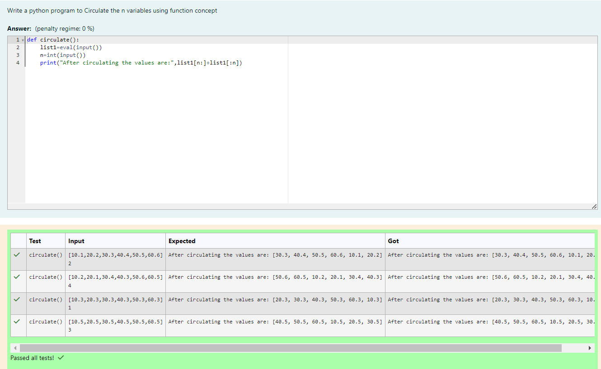

# Circulate-the-values-of-N-variables
## Aim:
To write a python program to circulate the n variables using function concept
## Equipment’s required:
PC
Anaconda - Python 3.7
## Algorithm: 
### Step 1: 
program the code with def circulate.
### Step 2: 
Get the value from the user for the number of rotation
### Step 3:
print the circulating values
### Step 4: 
Using the slicing concept rotate the list
### Step 5: 
evaluate the a input.
### Step 6: 
enter integer (n) in input.
## Program:
## Developed by:K.Ligneshwar
## Reg no:212223230113
## Program to circulate the n variables using function concept
```
def circulate():
    list1=eval(input())
    n=int(input())
    print("After circulating the values are:",list1[n:]+list1[:n])

```
## Output:

## Result:
The Circulate-the-values-of-N-variables is succeed.
